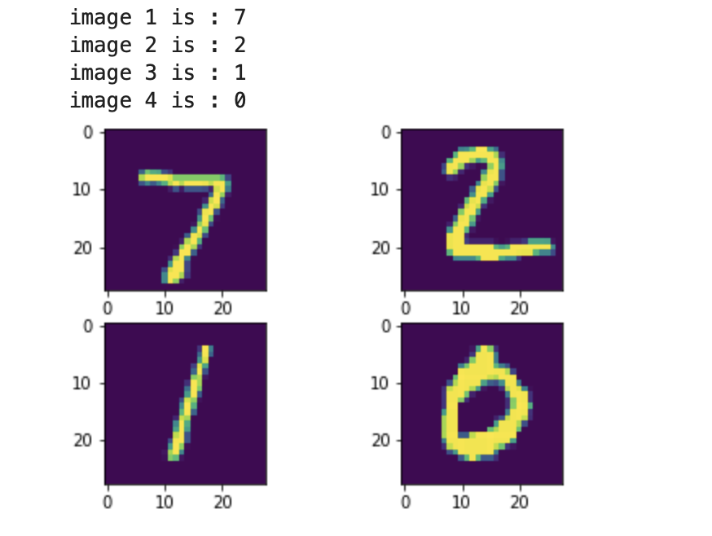

# Neural network - Hand written digit  

Builds a 3-layer neural network from scratch to recognize the MNIST Database of handwritten digits, only based on a python library numpy.

* Weight Initialization
* Layer
  * ReLu
  * Softmax
* Training
  * Backpropagation
  * Gradient Descent
* Loss
  * Cross-entropy Loss
  * Regularation Loss
  
## Results

* batch size: 1
* learning rate: 0.001
* epoch: 5
* accuracy: 0.9177

